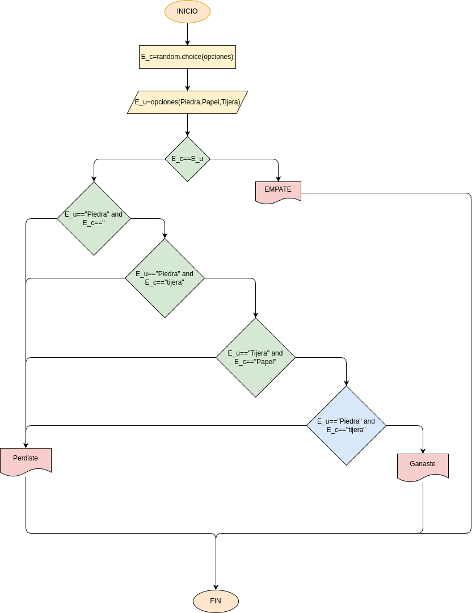

# Piedra_Papel_Tijera
Programa en python para jugar piedra papel o tijera contra el computador
## ¿como lo hice?
- por medio de una breve investigacion en chat gpt descubrio dos comandos nuevos, los cuales son 
#### "Opciones"
- este programa lo que hace es que se determinan cuales y cuantas opciones puede elegir el jugador en este caso, decicdiendo asi mediante lo que se elija 
#### "texto.lower()"
- este comando nos permite que cualquier palbara que se escriba en mayuscula se pase automaticamente en minuscula, sin este comando se tendria que especificar que si o si se tiene que escribir en mayuscula lo cual no seria tn comodo para los jugadores
## Diagrama de flujo

## Pero pur ultimo y no menos importante

## mi reaccion 
